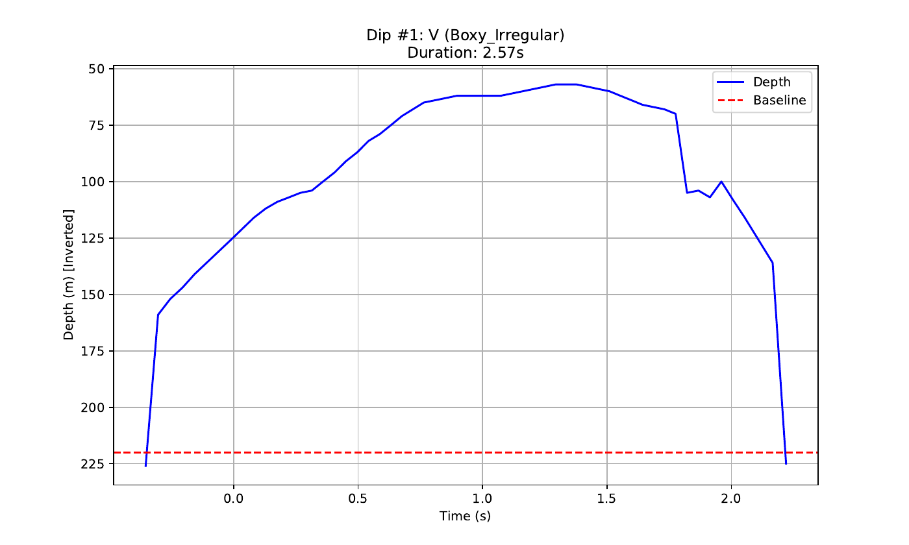
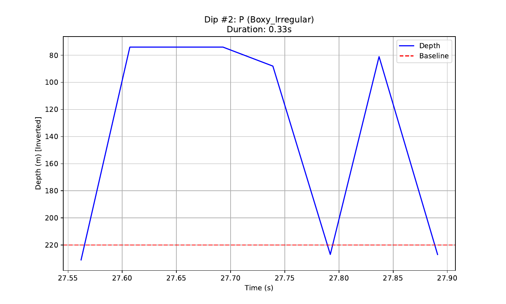
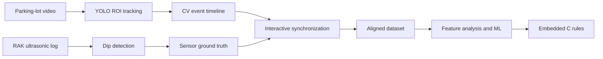

# CarparkCV

CarparkCV is an end-to-end vehicle-detection prototype that compares camera-based tracking with an ultrasonic RAK sensor, aligns both timelines, and turns the resulting measurements into rules suitable for embedded deployment.

## What I built

- **Computer-vision tracking:** a YOLO pipeline that selects a parking-area region of interest, tracks vehicles frame by frame, suppresses duplicate detections, and exports an event timeline.
- **Ultrasonic event detection:** signal-processing logic that identifies vehicle-shaped distance dips using adaptive baselines, variance, gradient, duration, and depth thresholds.
- **Sensor synchronization:** an interactive visualization for aligning CV and RAK timestamps, interpolating the CV signal onto the sensor timeline, and exporting a merged dataset.
- **Data-driven rule design:** dip feature extraction plus Random Forest and interpretable Decision Tree experiments used to identify the strongest vehicle indicators.
- **Embedded implementation:** a stateful C detector, public header, and integration example designed to move the validated rules onto a microcontroller.

## Included experiment result

On the checked-in set of 45 labeled sensor dips (24 vehicle and 21 non-vehicle), the Random Forest experiment reaches **96% mean accuracy in five-fold cross-validation** and **93% accuracy on the fixed held-out split**. This is a small project dataset rather than an external benchmark, but it demonstrates that the extracted ultrasonic features separate vehicle events from other observed objects in these trials.

The underlying EPICS-SCAN documentation provides the signal-level evidence behind that result. The examples below show a sustained 2.57-second vehicle return beside a much shorter 0.33-second pedestrian return; duration is only one of the nine features evaluated by the classifier.

| Labeled vehicle dip | Labeled pedestrian dip |
| --- | --- |
|  |  |

**Evidence provenance:** figures are rendered without alteration from pages 1-2 of the EPICS-SCAN [`dip_analysis_results.pdf`](https://github.com/EPICS-SCAN/SCAN-Documents/blob/main/Algorithm/Results/dip_analysis_results.pdf). The source repository also contains the [45-row feature dataset](https://github.com/EPICS-SCAN/SCAN-Documents/blob/main/Algorithm/Results/dip_analysis_results.csv), [synchronized CV/depth output](https://github.com/EPICS-SCAN/SCAN-Documents/blob/main/Algorithm/Results/detection_results_with_depth.csv), and the [documented end-to-end process](https://github.com/EPICS-SCAN/SCAN-Documents/blob/main/Algorithm/Overall%20Process.pdf). These are team-project artifacts; this repository presents my implementation work within that system.



## Repository guide

| Area | Files | Purpose |
| --- | --- | --- |
| Vision | `CV_Vehicle_tracking.py`, `Video_Crop_Tool.py` | Select an ROI, run YOLO tracking, export detections, and prepare video clips. |
| Sensor processing | `count_vehicles_rak.py` | Detect vehicle events in raw ultrasonic distance logs. |
| Synchronization | `SyncVis.py` | Visually align CV and RAK timelines and export merged/interpolated data. |
| Analysis | `dip_analyzer.py`, `dip_classifier.py`, `cv_tracking_rules.py` | Extract dip features, test classifiers, and translate findings into tracking rules. |
| Embedded deployment | `vehicle_detector.c`, `vehicle_detector.h`, `main_example.c`, `count_vehicles_rak.c` | Run the detector as portable C and demonstrate integration. |
| Evidence and outputs | `*.csv`, `*.TXT`, `dip_analysis_results.pdf`, `*.drawio`, `*.xml` | Recorded trials, aligned outputs, analysis artifacts, and system diagrams. |

The checked-in `yolo12n.pt` file is the pretrained Ultralytics model weight used by the vision pipeline; the tracking, synchronization, sensor analysis, and embedded logic in this repository are the project-specific work.

## Quick start

Requires Python 3.10+ and FFmpeg (only for the crop tool).

```bash
python -m venv .venv
# Windows
.venv\Scripts\activate
pip install -r requirements.txt
```

Run the included dip-classification experiment:

```bash
python dip_classifier.py --input dip_analysis_results.csv --output dip_analysis_results_with_ml.csv
```

Run the ultrasonic detector against the included test log:

```bash
python count_vehicles_rak.py
```

Run the synchronization interface after producing `detection_results.csv`:

```bash
python SyncVis.py
```

`CV_Vehicle_tracking.py` currently exposes its video path and display options in the `__main__` block. Set `video_path` there to a local recording, then run:

```bash
python CV_Vehicle_tracking.py
```

## Embedded example

The compact detector API is declared in `vehicle_detector.h`. A typical GCC build is:

```bash
gcc vehicle_detector.c main_example.c -o vehicle_detector_demo
```

Call `vehicle_detector_init()` once, then pass each timestamped distance sample to `vehicle_detector_process()`. The function reports completed vehicle events while maintaining calibration and tracking state internally.

## Notes

- The included datasets are experiment artifacts, not a general benchmark.
- Several scripts open interactive OpenCV or Matplotlib windows and therefore require a desktop session.
- Detection thresholds reflect the tested sensor placement and should be recalibrated for a different geometry or sampling rate.
